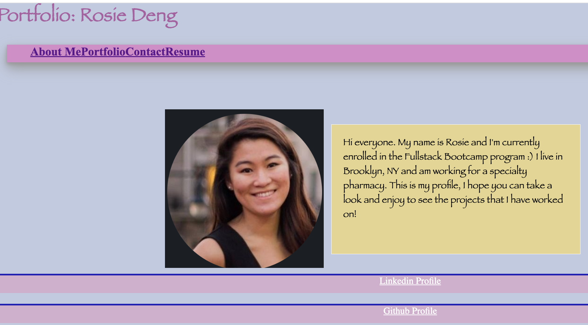
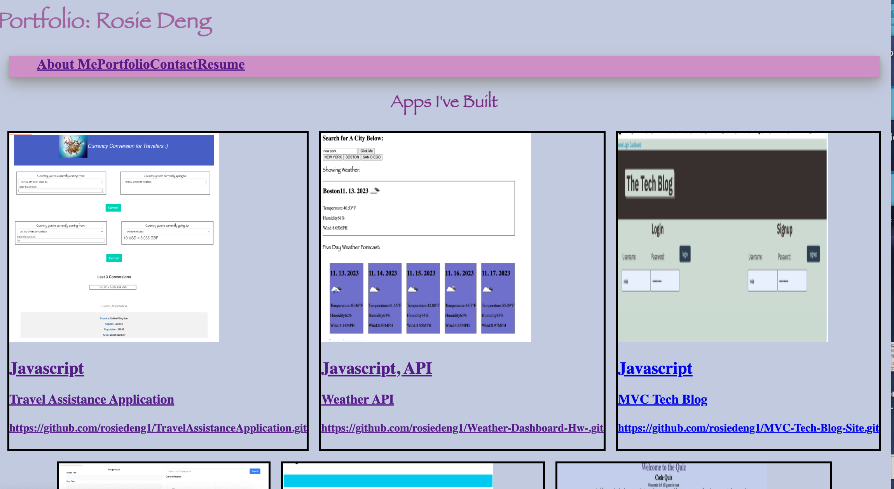
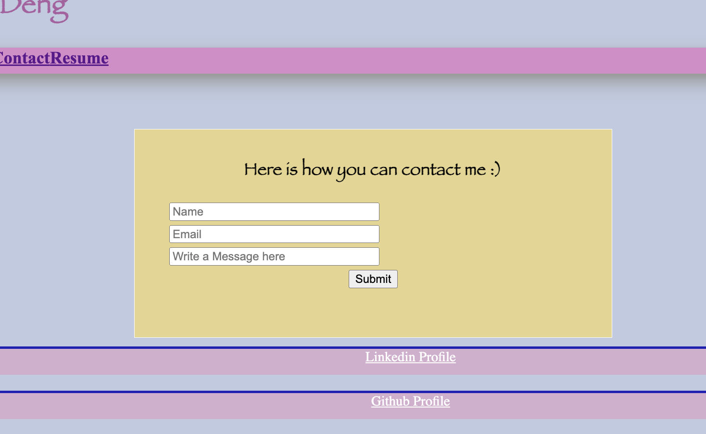

# React Portfolio

## Description 
The motivation behind the project was to create a React portfolio using the front end so that users can see my profile and specific projects that I have worked on and details about myself. The reason why we created this application is because it creates an application that is easy to navigate as well as allowing potential employers/anyone that I'd like to see the things that I have worked on in one consolidated place. We used React because it allows us to use javascript with html to create dynamic applications. It solves the problem of allowing users to see my information in an organized and interactive manner. I learned a lot about using components, importing those components into an App jsx file and allowing my different pages to route together so that everything works cohesively. 

## Installation 
First run npm create vite@4.4.1 in order to create your React application. Then run npm install to install the appropriate packages and dependencies that you would like to use. Then run npm run start to start your application 

## Usage 

## Credits 
Tutoring session with Meg Meyers was a source of help in this assignment. ASKBCS also helped to resolve minor issues. 

## License 
Please refer to the LICENSE in the repo